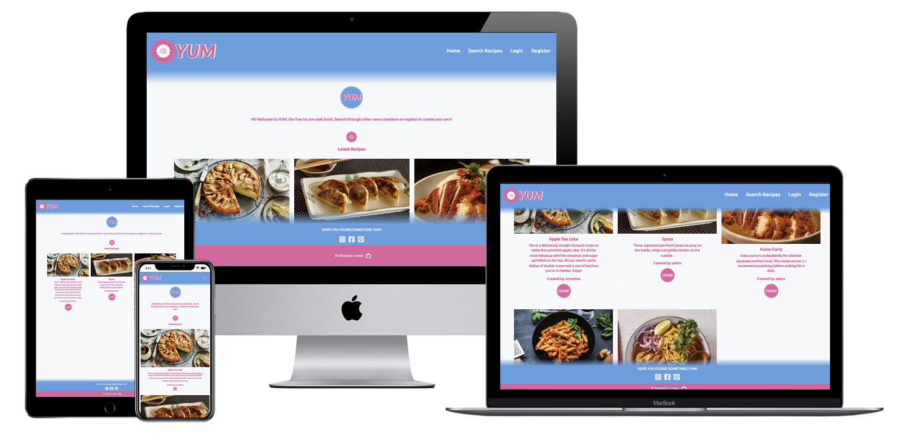
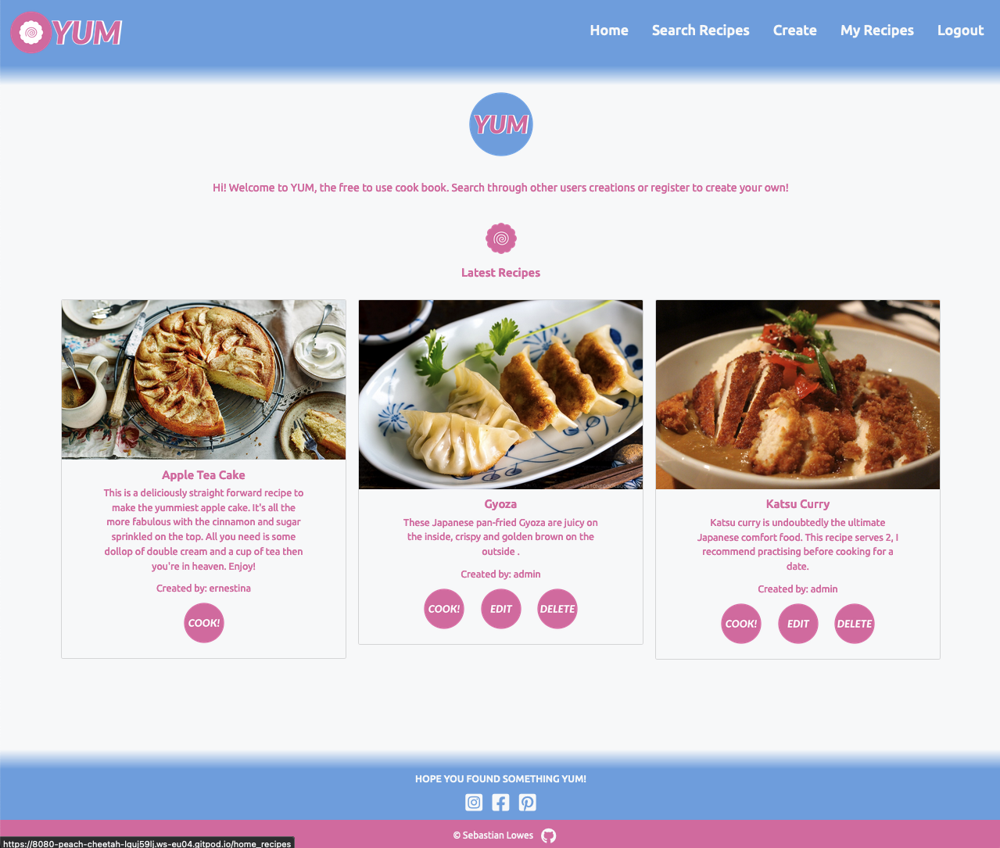
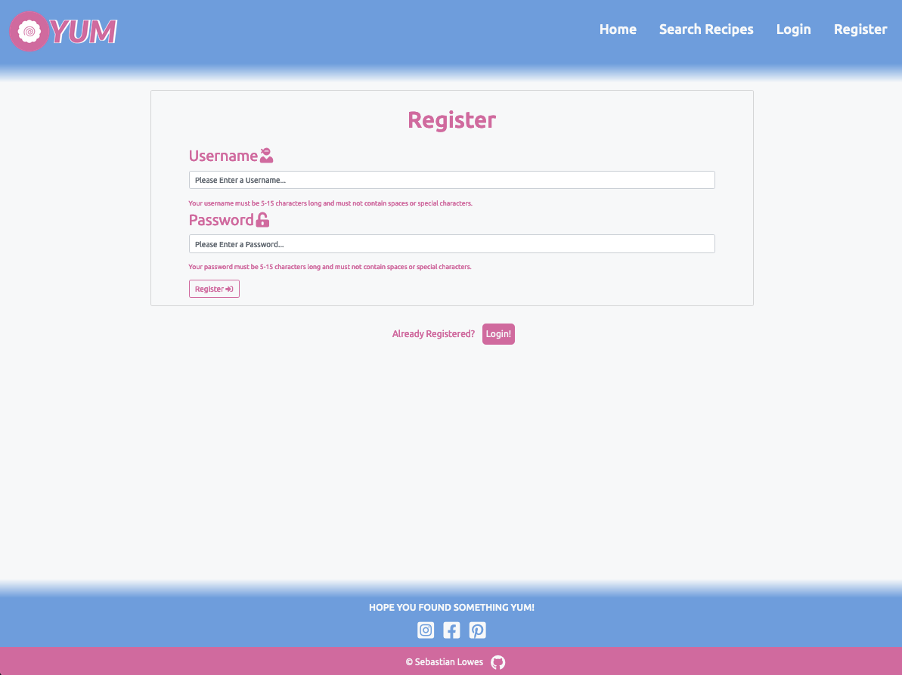
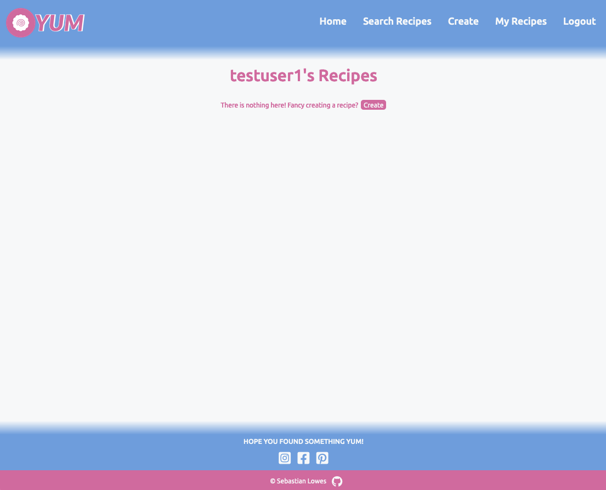
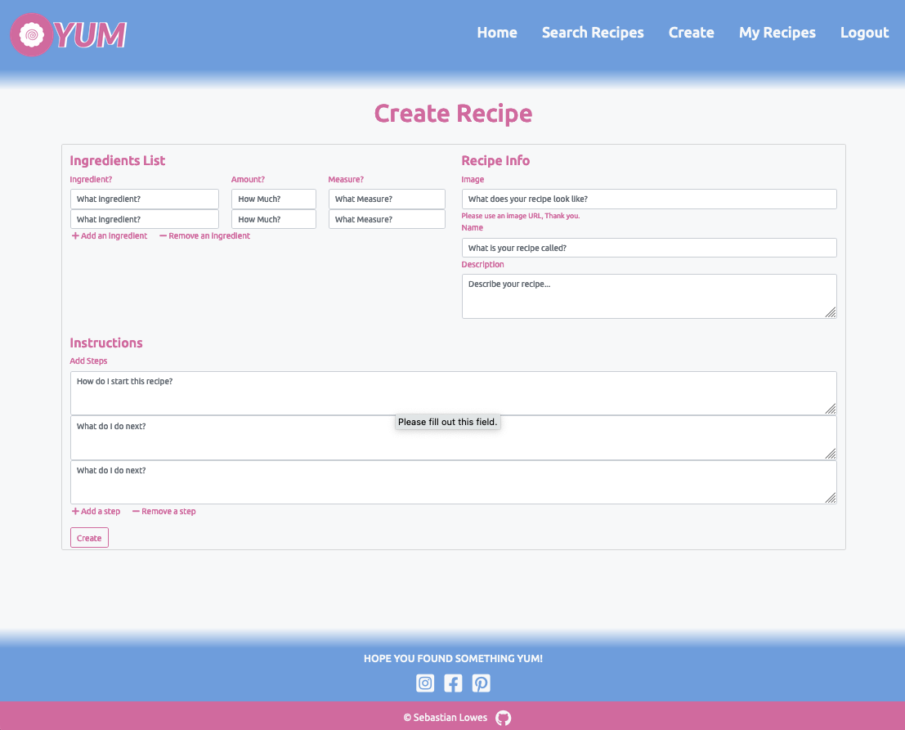
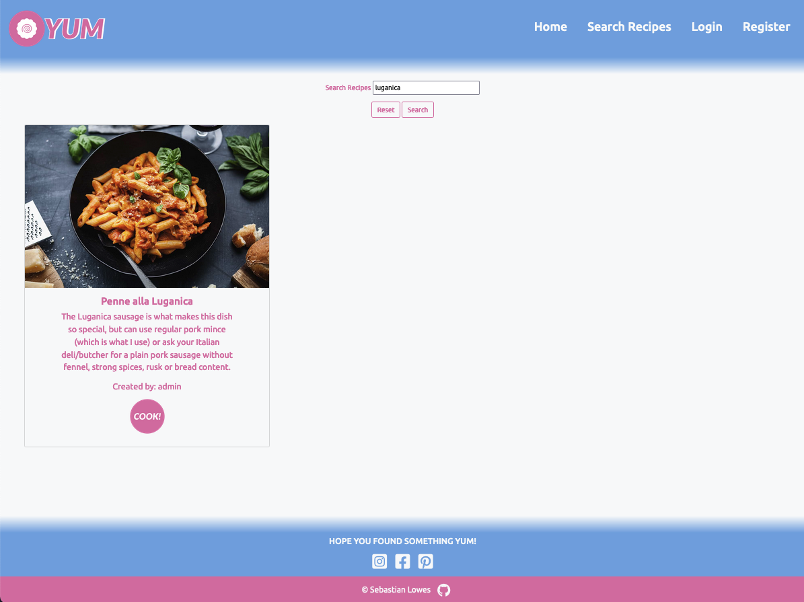
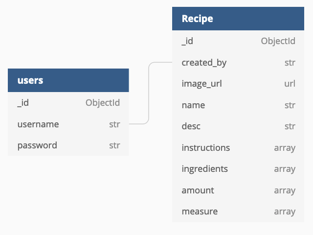

# MS3: View Live Project [Here](https://flask-yum-cook-book.herokuapp.com/)

YUM is a colourful recipe book website built with Python, Flask, MongoDB, JavaScript, CSS, Bootstrap and HTML. It includes CRUD functionality (Create, Read, Update Delete) and is designed to be responsive across multiple devices. YUM allows the user to browse recipes created by other users aswell as creating their own.

## User Experience

### New User Journey

1. The user begins at the Homepage and is prompted to register so they can create a recipe. 
1. Or they can take a look at 3 of the most recent recipes created by other users.

1. Upon clicking 'Register' the user can then create an account.

1. After making an account they are automatically logged in and taken to their recipe page.
1. If they already have recipes then those will displayed.
1. If not, then the user is prompted to create a recipe.

1. If the user then decides to create a recipe they can click the create recipe tab in the navbar or the button on 'My Recipes'.
1. This brings them to the creation page. This Dynamic form allows the user to add ingredients and instructions dynamically.
1. Once the recipe is created it will appear in their 'My Recipes' tab.
1. They can edit and delete any recipe that they make.

1. If the user wishes to search for their own recipe or for one created by another user, they can do so from the search page. This is reached by clicking 'Search Recipes' in the navbar.

### User Stories

- First Time Visitor
    - When I visit this site I want to understand how I can interact with the website.
    - I want to find a recipe to cook.
    - I would also consider making an account.
- Returning Visitor
    - As a returning visitor I may be searching for the same recipe.
    - I have returned to register an account so that I can create a recipe.
    - I may be logging in to create my own recipe.
- Frequent User
    - As a frequent user I would be looking to create multiple recipes.
    - I may also be searching through other users recipes to find inspiration or a recipe to cook.

### Design

- Colour Scheme
    - I decided to take inspiration from 'Narutomaki' which is a topping used on ramen. This led me towards a pink and white color scheme. I opted also to use a blue as it was one of the triadic colours from the pink I had sampled.
- Typography
    - I used Ubuntu and Fira Sans. These were chosen due to their softness which complimented the logo.
- Imagery
    - In keeping with the Narutomaki theme I used this in the logo and some icons. The images present on the website are those provided only by the users.
- Wireframes
    - I created wireframes for the basic ideas. The overall structure of the website persists from the wireframes to the complete project. However many of the pages now only vaguely resemble the final product.
        - [Homepage](documentation/wireframes/wf_home.png)
        - [My Recipes](documentation/wireframes/wf_myrecipes.png)
        - [Create Recipe](documentation/wireframes/wf_create.png)
        - [Cook Recipe](documentation/wireframes/wf_cook.png)
        - [Login](documentation/wireframes/wf_login.png)
        - [Register](documentation/wireframes/wf_register.png)

## Features

- The website allows the user to find and read recipes created by themselves or by other users.
- The website is responsive across different devices.
- Navigation bar is responsive and condenses into a icon on smaller devices.
- User's recipes act in a similar way to a hero image in enticing new users to the website.
- It is easy to create recipes via the dynamic form.
- The same form is used to edit the recipes making this very simple.
- Footer contains links to social media websites that open in a new tab.
- Registration is simple and the acceptable formats for a username and password are explained.
- Confirmation messages appear after completing actions such as registering, logging in, editing & creating a recipe.

## Data Schema

MongoDB was used to host the database. Ingredients, Amount and Measure were originally going to be kept in the same array. However, after speaking with tutor support I was persuaded away from this. I combine these arrays with pythons Zip function and then display this within cook.html. I opted to use an image URL after receiving an email from Student Care suggesting I do so.

## Taking The Project Further (Additional Features)

Due to the nature of this project it feels like I could endlessly continue adding features. But If I were taking it further these are some features I believe the webstie would benefit from:
- I would want to take a closer look at how users navigate the creation form. (Using tab key)
- Allow users to delete particular form inputs rather than always the last one they added.
- Allow users to add input fields at any point in the form (drag and drop)
- A comment and liking system to encourage interactivity of users.
- The website would benefit from a more complete sharing system to social media. (share this recipe etc.)

## Technologies

### Languages

- [HTML5](https://en.wikipedia.org/wiki/HTML5)

- [CSS3](https://en.wikipedia.org/wiki/CSS)

- [JavaScript](https://en.wikipedia.org/wiki/JavaScript)

- [Python](https://en.wikipedia.org/wiki/Python_(programming_language))

### Frameworks, Libraries & Programs Used

1. [Bootstrap](https://getbootstrap.com/)

1. [Flask](https://en.wikipedia.org/wiki/Flask_(web_framework))

1. [MongoDB](https://www.mongodb.com/)

1. [PyMongo](https://pymongo.readthedocs.io/en/stable/index.html)

1. [Werkzeug](https://werkzeug.palletsprojects.com/en/1.0.x/)

1. [Heroku](https://en.wikipedia.org/wiki/Heroku)

1. [Gitpod](https://www.gitpod.io/)

1. [Git](https://git-scm.com/)

1. [Github](https://github.com/)

1. [Firefox Dev Tools](https://firefox-dev.tools/)

1. [Google Fonts](https://fonts.google.com/?query=Oswa)

1. [Font Awesome](https://fontawesome.com/)

1. [Balsamiq](https://balsamiq.com/)

1. [Favicon.cc](https://www.favicon.cc/)

1. [TinyPNG](https://tinypng.com/)

1. [Multi Media Mockup](https://techsini.com/multi-mockup/)

1. [Adobe Spark](https://spark.adobe.com/sp)

1. [DBDiagram](https://dbdiagram.io/home)

## [TESTING](TESTING.md)

Testing information can be found here: [TESTING](TESTING.md)

## Deployment, Forking, Cloning

### Deployment to Heroku

##### Create Application

1. Navigate to Heroku.com and login.
1. Click on the "New" button in the top right of the page and select "Create new app."
1. Enter the name of the app, select the region and click "Create app."

##### Connect to GitHub Repository

1. Click the deploy tab and select "GitHub - Connect to GitHub."
1. Under the section "Search for a repository to connect to" enter the repository name in the box provided.
1. Once the repository has been found, click the "Connect" button.

##### Setting Environment Variables

Click on the settings tab and then click "Reveal Config Vars" and add the following:
- key: IP, value: 0.0.0.0
- key: PORT, value: 5000
- key: MONGO_DBNAME. value: (Name of database you want to connect to)
- key: MONGO_URI, value: (Enter MongoURI which can be found by going to Clusters > Connect > Connect to your application and inputting the password and Database name)
- key: SECRET_KEY, value: (This is a unique secret key that was created by the developer)

##### Enable Automatic Deployment

1. Click on the Deploy tab
1. Under the "Automatic Deploy" section, select the branch from GitHub that you want to deploy the app from and then click Enable Automatic Deploys

### Forking the GitHub Repository

By forking the GitHub Repository we are making a copy of the original repository on a GitHub account to view and/or make changes without affecting the original repository. This is done with the following steps:

- Log in to [GitHub](https://github.com/) and locate the GitHub Repository.
- At the top of the Repository just above the "Settings" button on the menu, locate the "Fork" button.
- Click the button and now you should have a copy of the original repository in your GitHub account.

### Making a Local Clone

- Log in to [GitHub](https://github.com/) and locate the GitHub Repository.
- Under the repository name, click "Clone or download".
- To clone the repository using HTTPS, under "Clone with HTTPS", copy the link.
- Open Git Bash
- Change the current working directory to the location that you want the cloned directory to be made.
- Type `git clone`, and then paste the URL you copied earlier.

Click [Here](https://help.github.com/en/github/creating-cloning-and-archiving-repositories/cloning-a-repository#cloning-a-repository-to-github-desktop) for a more detailed explanation of the cloning process.

## Credits

### Code & Media

The space to share any resources I have used to help me build this project.

1. [Tempalate Literals](https://medium.com/@tforward/get-html-to-the-dom-fast-with-js-template-literals-insertadjacenthtml-24b8aa4e8807)

1. [Python Docstrings](https://stackabuse.com/python-docstrings/)

1. [Flask Error Handling](https://www.askpython.com/python-modules/flask/flask-error-handling)

1. [Abdul Basit - Dynamic Forms](https://www.youtube.com/watch?v=MLBLsxcB3Dc)

1. [Zip](https://www.w3schools.com/python/ref_func_zip.asp)

### Acknowledgements

- My mentor Aaron Sinnott for the helpful feedback.
- Tim from tutor support for mentioning Zip to me.